# Basil

  

A Compose Multiplatform recipe management app for mobile / web / desktop. Binaries are in the release section.

| Feature | Mobile | Tablet | Desktop |
| --- | :---: | :---: | :---: |
| Recipes |  | 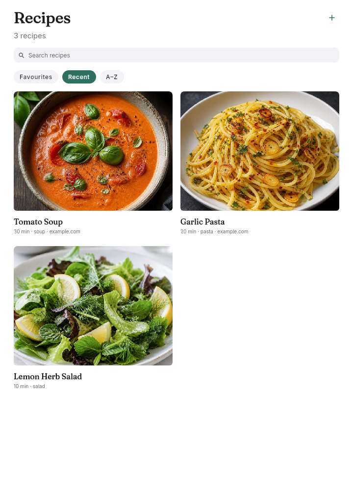 | 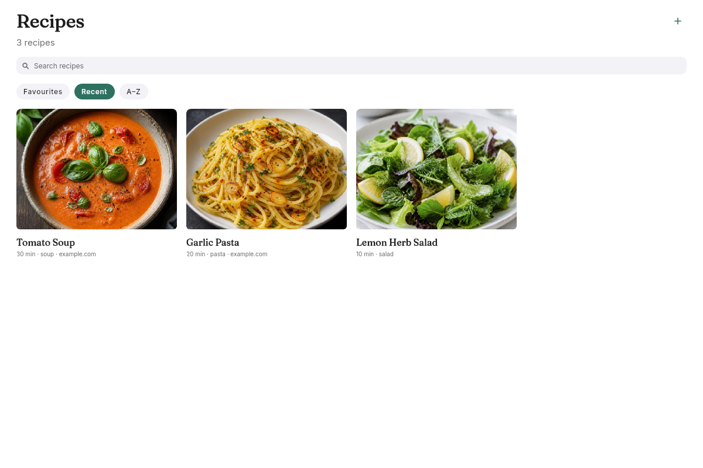 |
| Recipe detail | 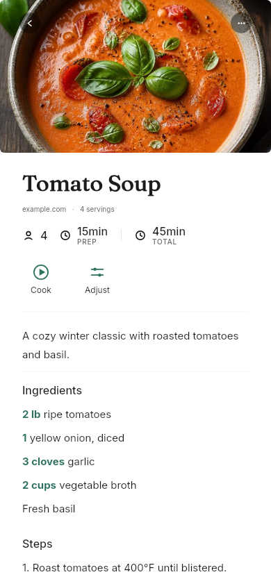 | 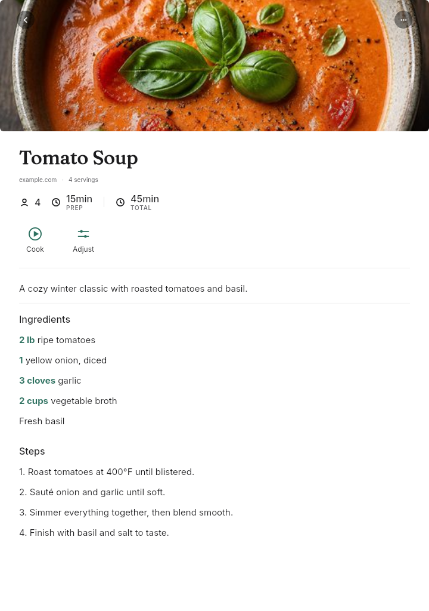 | 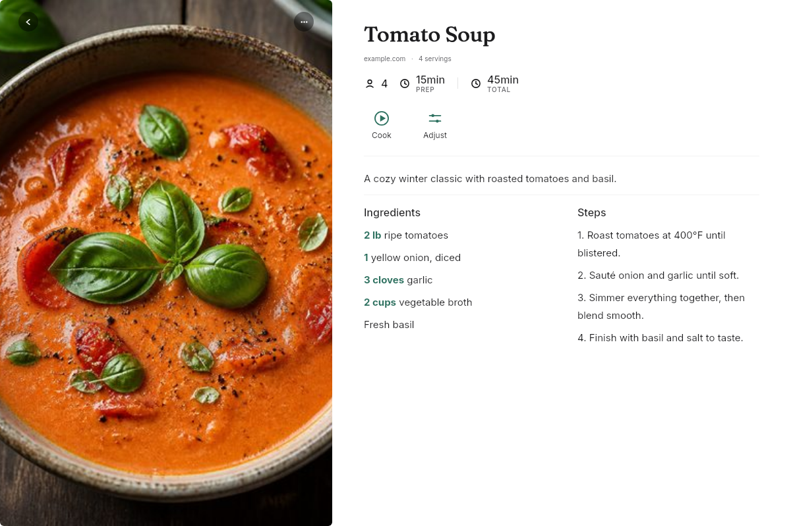 |
| Cook | 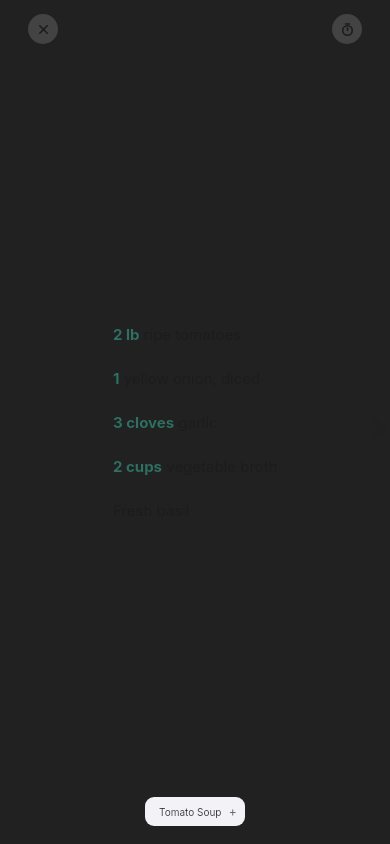 | 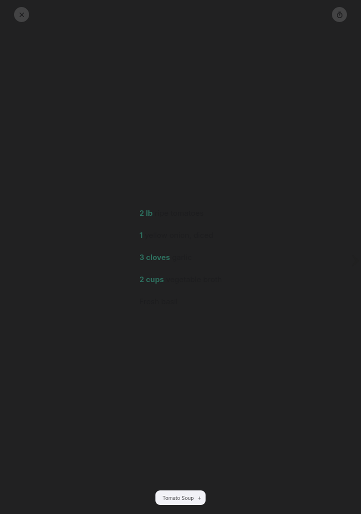 | 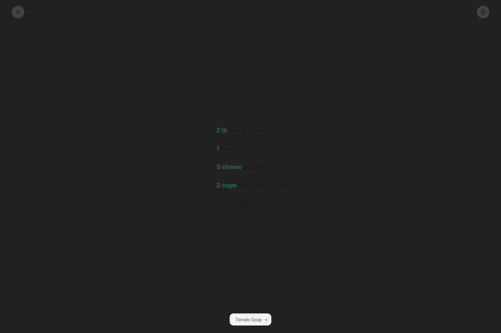 |
| Import | 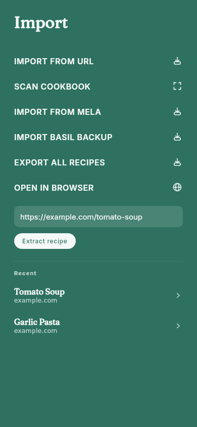 | 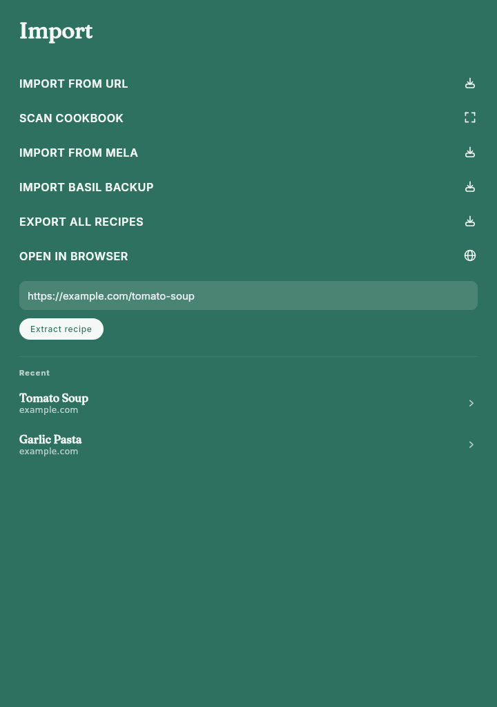 | 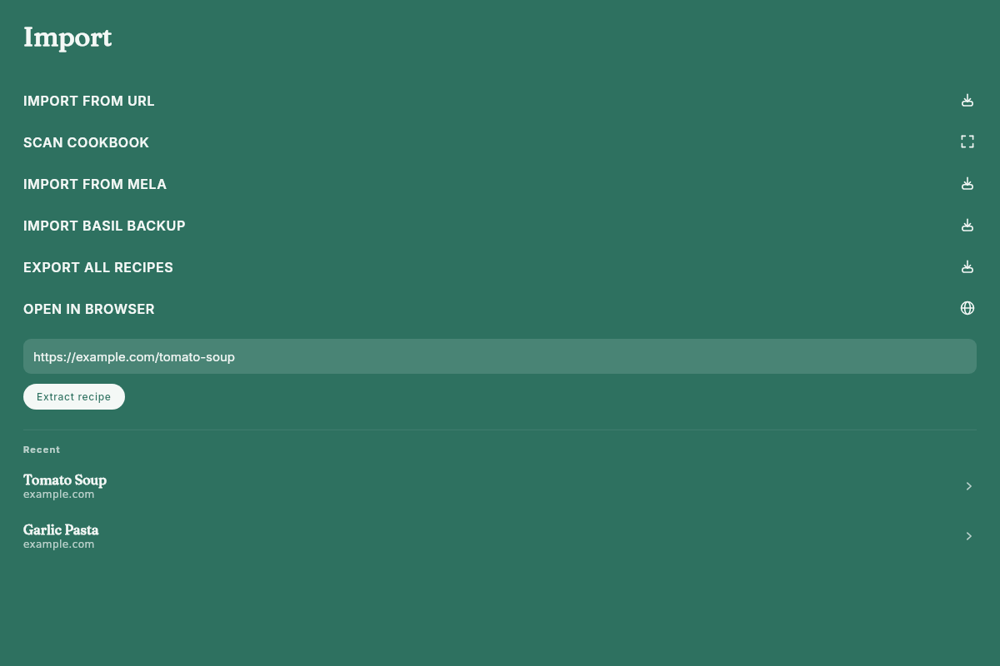 |
| Editor |  | 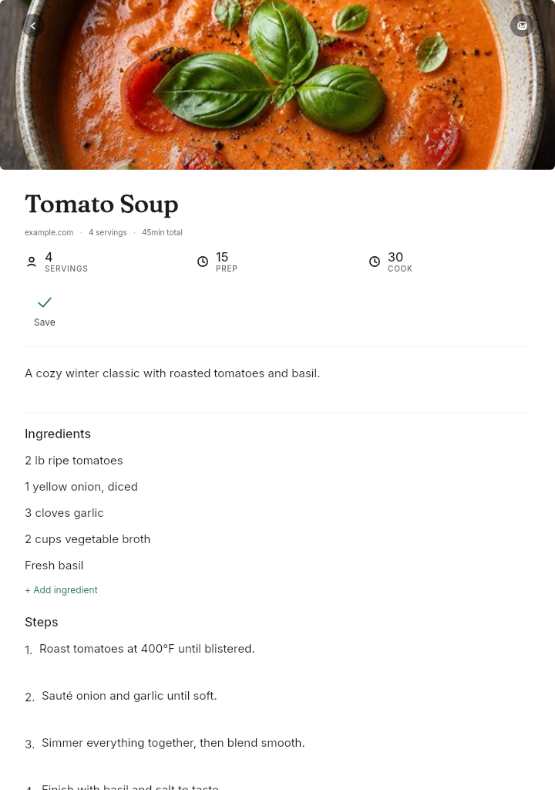 | 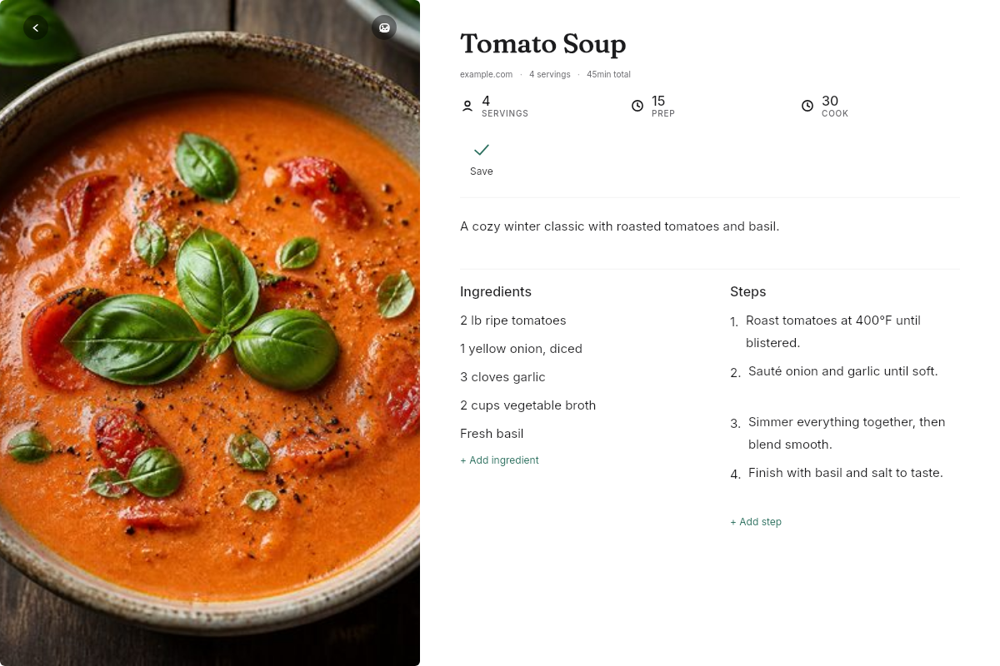 |
| Account | 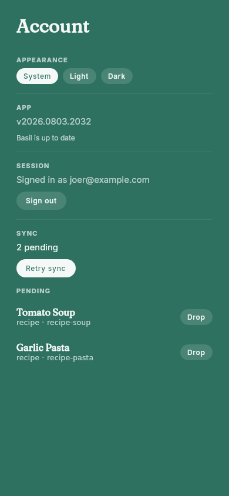 | 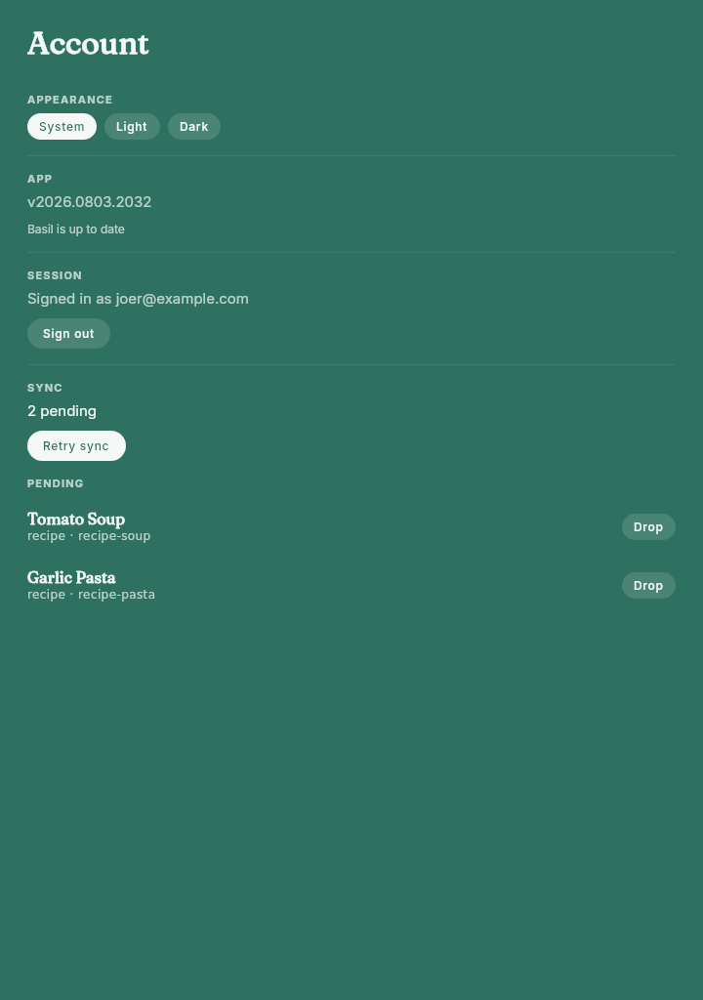 | 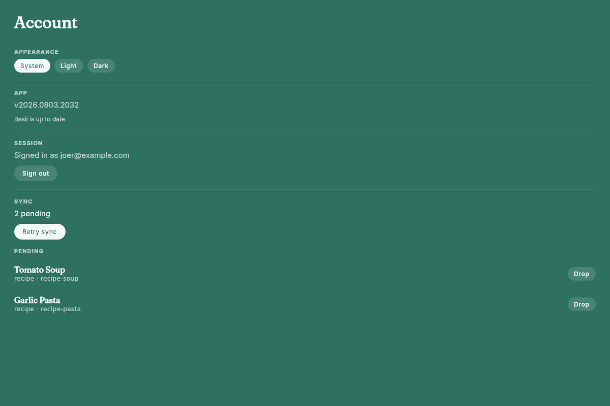 |
| Auth |  | 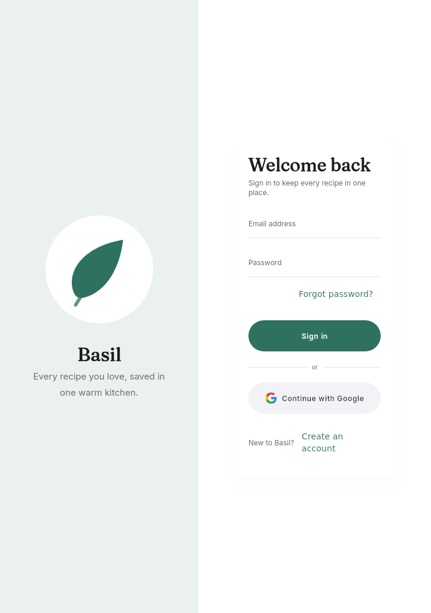 | 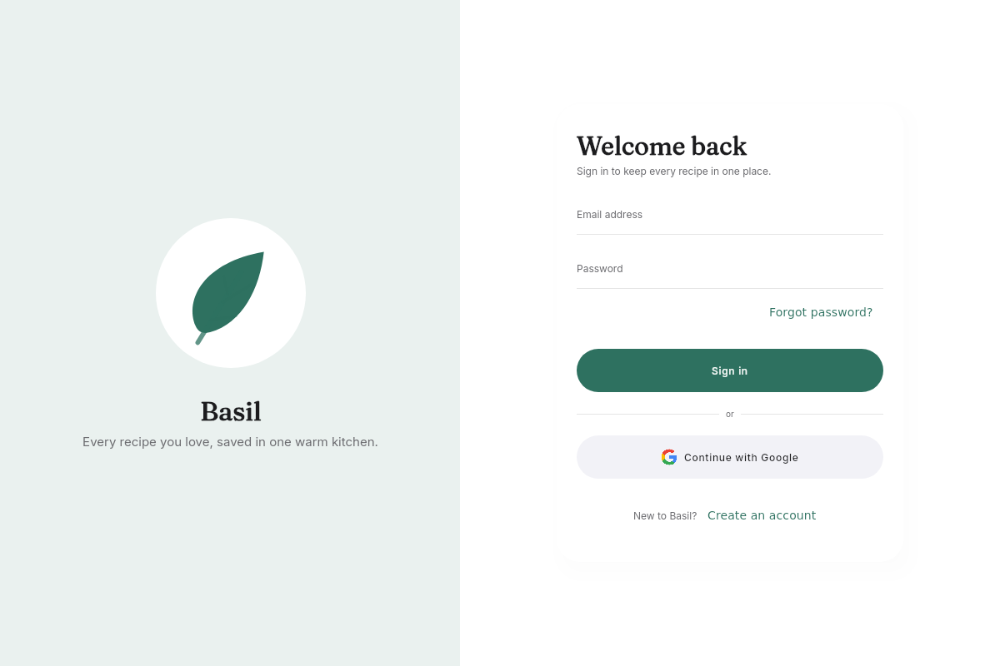 |
| Scan |  |  | 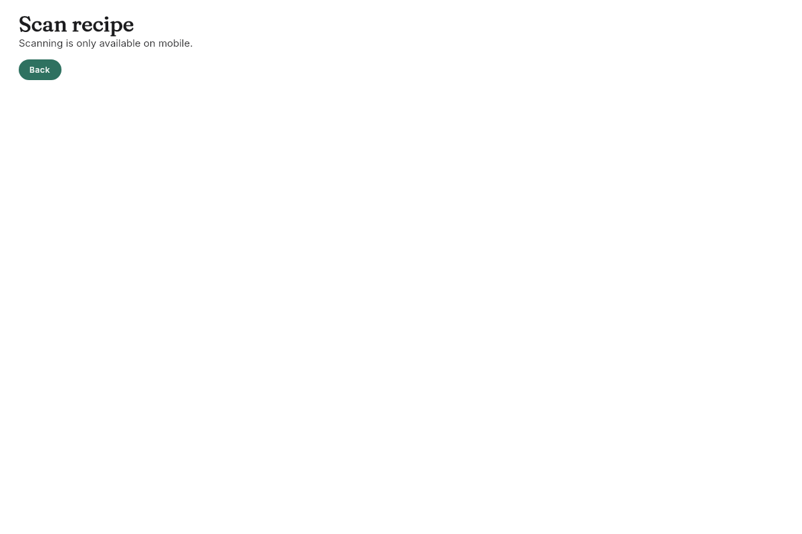 |
